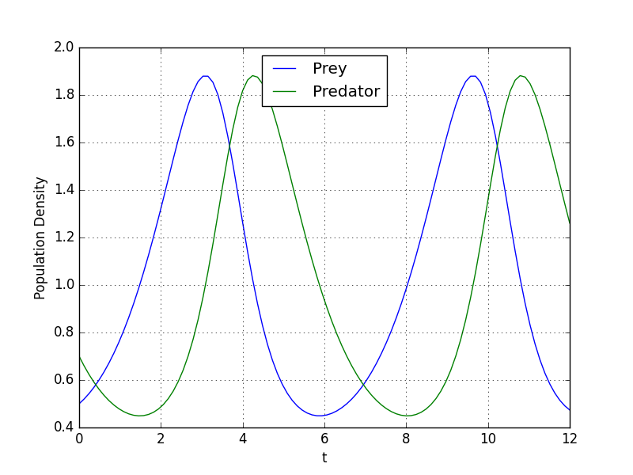
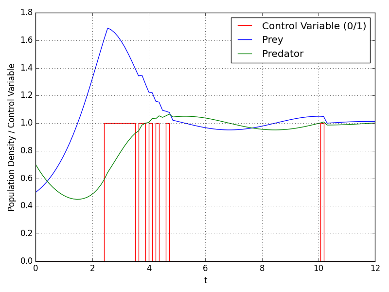

Optimal control theory is a field of control theory that focuses on identifying the best way to control a dynamic system within a given time frame to achieve an optimized objective function while accounting for any constraints or limitations on the system. As we can see from this definition, an optimal control problem has three components:

1. Mathematical description of the system to be controlled
2. Specification of a performance criterion (cost function)
3. Specification of constraints (i.e. initial & boundary conditions)

In this text, we will not examine the existince of admissible controls, we will just assume that admissible controls are exists for problems.

## Lotka-Volterra Equations

Lotka-Volterra equations are a pair of first-order nonlinear differential equations, used to describe the dynamics of two biologicals species' interaction, one as a predator and the other as prey:

$$
\begin{align}
\frac{dx}{dt} &= \alpha x - \beta xy \\
\frac{dy}{dt} &= -\gamma y + \delta xy
\end{align}
$$

where:

* $x$ is the population density of prey;
* $y$ is the population density of predator;
* $t$ is the time;
* $\alpha$ and $\beta$ describes prey's growth rate and effect of the presence of predators on prey's growth rate, respectively.
* $\gamma$ and $\delta$ describes predators's death rate and effect of the presence of prey on predator's growth rate, respectively.

In our example, we will let $\alpha=\beta=\gamma=\delta=1$.

Let's simulate the system with following parameters:

$t_0=0, t_f=12$

$x(0)=0.5, y(0)=0.7$

::: {.callout-note appearance="simple" collapse="true"}

## Code - Lotka-Volterra Simulation

```python
import numpy as np
from scipy.integrate import odeint

t0 = 0
tf = 12
X0 = [0.5, 0.7]

def lotka_volterra(X, t):
    x, y = X
    dx = x - x * y
    dy = - y + x * y
    return [dx, dy]

t = np.linspace(t0, tf, 100)
sol = odeint(lotka_volterra, X0, t)

import matplotlib.pyplot as plt
plt.style.use('classic')
plt.plot(t, sol[:, 0], 'b', label='Prey')
plt.plot(t, sol[:, 1], 'g', label='Predator')
plt.legend(loc='best')
plt.xlabel('t')
plt.grid()
plt.savefig("prey_predator_uncontrolled.png")
plt.show()
```

:::

Result:



As we can see from graph, prey and predator population density values oscillates between 0.45 and 1.88.

## Lotka-Volterra Fishing Problem

We can define mixed-integer optimal control problem in Mayer form as follows:

$$
\min x_2(t_f)
$$

subject to

$$
\begin{align}
\frac{dx_0}{dt} &= x_0 - x_0x_1 - c_0x_0 w \\
\frac{dx_1}{dt} &= -x_1 + x_0x_1 - c_1x_1 w \\
\frac{dx_2}{dt} &= (x_0-1)^2 + (x_1-1)^2
\end{align}
$$

where $x(0)=(0.5,0.7,0)^T$ and $w(t)\in\{0,1\}$. The third state $x_2$ is used to transform the objective into the Mayer formulation. The decision, whether the fishing fleet is actually fishing at time $t$ is denoted by $w(t)$.

::: {.callout-note appearance="simple" collapse="true"}

## Code - Optimal Control Example

```python
from gekko import GEKKO

m = GEKKO(remote=False)
m.solver_options = ['minlp_gap_tol 0.001',\
                    'minlp_max_iter_with_int_sol 100',\
                    'minlp_branch_method 1',\
                    'minlp_integer_tol 0.001',\
                    'minlp_integer_leaves 0',\
                    'minlp_maximum_iterations 200']

m.time = np.linspace(t0, tf, 100)
x0 = m.Var(value=0.5,lb=0)
x1 = m.Var(value=0.7,lb=0)
x2 = m.Var(value=0.0,lb=0)
w = m.MV(value=0,lb=0,ub=1,integer=True)
w.STATUS = 1
last = m.Param(np.zeros(100))
last.value[-1] = 1
m.Minimize(last*x2)

m.Equations([x0.dt() == x0 - x0*x1 - 0.4*x0*w,\
             x1.dt() == - x1 + x0*x1 - 0.2*x1*w,\
             x2 == m.integral((x0-1)**2 + (x1-1)**2)])

m.options.IMODE = 6
m.options.NODES = 3
m.options.SOLVER = 1
m.options.MV_TYPE = 0
m.solve()

plt.figure(figsize=(6,4))
plt.step(m.time,w.value,'r-',label='Control Variable (0/1)')
plt.plot(m.time,x0.value,'b',label=r'Prey')
plt.plot(m.time,x1.value,'g',label=r'Predator')
plt.xlabel('t'); plt.ylabel('Biomass / Control Variable')
plt.legend(loc='best'); plt.grid(); plt.tight_layout()
plt.savefig("prey_predator_controlled.png")
plt.show()
```

:::

Result:



As we can see from graph, with control variable, oscillation dampens and population density values converges to 1.

## References

$^1$ [Solve a Lotka-Volterra based ODE Optimal Control Problem](https://www.mathematik.uni-konstanz.de/en/volkwein/python/oppy/Notebooks_Web/lotka_volterra_optimal_control.html)
$^2$ [Lotka Volterra fishing problem](https://mintoc.de/index.php/Lotka_Volterra_fishing_problem)
$^3$ [Lotka Volterra Fishing Optimization](https://apmonitor.com/do/index.php/Main/LotkaVolterra)
$^4$ [Introduction to Optimal Control](https://www.princeton.edu/~aaa/Public/Teaching/ORF523/ORF523_S21_Guest_Lecture.pdf)
